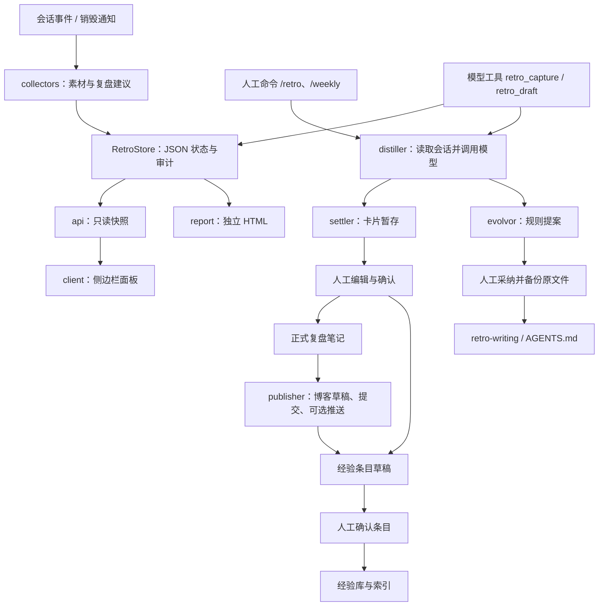

# 当前架构

本文描述 `dsh-retro 0.3.0` 的现有实现。安装、配置与命令说明见 [English README](../README.md) 或[中文 README](../README.zh-CN.md)。

## 入口与部署

仓库根目录是正式 ESM npm 包，源码继续保存在 `dsh-retro/lib/`。子目录中的私有清单用于兼容既有本地链接；两份清单复用同一份源码、技能和 patch，由 `scripts/check.mjs` 校验关键字段一致。

| 入口 | 目标 | 用途 |
| --- | --- | --- |
| `dsh-retro` | `dsh-retro/lib/index.js` | 宿主插件，导出 `name`、`inject`、`apply` |
| `dsh-retro/client` | `dsh-retro/lib/client.js` | 浏览器模块工厂，由宿主模块加载器执行 |
| `dsh-retro/cordis.patch.yml` | `dsh-retro/cordis.patch.yml` | bundle 插入 `id: retro`、`name: dsh-retro` |
| `dsh-retro/package.json` | 根目录清单 | 提供 bundle 和客户端发现元数据 |

DSH 按 `dsh.bundle.patch` 装配宿主插件；`dsh.client: { platform: "web", inject: [] }` 声明浏览器部分。客户端发现依赖裸包名，因此 patch 不使用源码相对路径作为插件名称。

宿主必需服务为 `commands`、`llm`、`sessionQuery`、`tools`。`webServer` 通过可选注入注册，不作为宿主启动的强制依赖。会话事件由 Cordis 全局事件机制提供。运行时依赖在清单中声明为 peer dependencies，开发测试固定到 DSH `0.1.2-rc.1` 和 Cordis `4.0.2`。

## 数据流

这是一条按事件与命令推进的流程，没有后台队列执行器或定时调度器。自动采集记录素材和建议；模型生成由草稿工具或人工命令触发。周报间隔只用于提示。

## 模块职责

| 模块 | 职责与边界 |
| --- | --- |
| `index.js` | 合并配置、创建共享存储，初始化目录和配套技能，注册采集、命令、工具与可选 API |
| `config.js` | 默认配置、运行时文件、环境变量补齐、命令值类型解析 |
| `store.js` | 单进程内存状态与 JSON 持久化，维护素材、卡片、条目、提案、发布及审计 |
| `collectors.js` | 采样目标完成、反馈、复盘意向、工具错误；会话销毁时按需提出建议 |
| `distiller.js` | 构造会话文本、长文本分段归纳、卡片与周报生成、结构化规则提案 |
| `settler.js` | 暂存路径路由、模板渲染、人工确认后的落库与经验条目生成 |
| `evolvor.js` | 首次技能安装、提案文件、采纳追加与备份、文本相似度提示、经验库索引 |
| `publisher.js` | 固定 Markdown 博客约定下的草稿、发布及文章元数据抓取 |
| `commands.js` | 人工操作入口、参数解析、反馈文本、跨平台报告打开 |
| `tools.js` | `defineTool` 注册、输入输出契约、模型调用的取消与超时 |
| `api.js` | 生成面板快照，注册 GET/HEAD 只读路由及卸载回调 |
| `client.js` | 模块工厂、原生插槽或浮动入口、轮询、复制命令、Obsidian URI |
| `report.js` | 将当前存储渲染为独立 HTML，不直接操作文件 |
| `util.js` | 原子写入、路径约束、命名、文本与有限 YAML/Templater 处理 |

## 宿主生命周期与契约

`apply(ctx, config)` 从第二个参数读取 Cordis 行配置。配置和存储实例由采集器、命令、工具、API 共享；`/retro config` 成功保存后原位更新配置对象，使下一次操作立即读取新值。

`session/event` 接收追加到会话日志的事件；`session/disposed` 是独立生命周期通知。采集器按 `callId` 将工具调用与结果配对，无法配对时用 `tool` 表示名称。已有卡片或待处理建议的会话不重复创建建议。

模型工具使用 DSH 的 schema DSL，其中字段内的 `required: true` 由 `defineTool` 编译为 JSON Schema。可空字段使用 `oneOf`，输出渲染为 `ContentBlock[]` 文本块。`retro_draft` 合并调用者取消信号与自身超时，并在生成完成后再次检查取消状态，再写卡片与文件。

LLM 请求使用 `createUserMessage` 构建内容块数组，经 `ctx.llm.stream` 获取流式结果并用 `BlockAssembler` 汇总。单会话文本按配置分段；读取会话标题时兼容官方 `readTitle()` 返回的标题快照。

初始化异常写入状态目录的 `apply-error.log`。目录配置错误会给出日志提示，用户仍可通过配置命令修正路径。

## 状态与人工操作

| 对象 | 状态 / 转换 | 触发方式 |
| --- | --- | --- |
| 素材 | 按类型追加 | 事件采样或 `retro_capture` |
| 复盘建议 | `pending`，类型 `retro-suggest` | 目标完成或会话销毁 |
| 卡片 | `drafted → reviewing / approved / discarded` | `draft`、`review edit / keep / discard` |
| 经验条目 | `drafted → approved` | 卡片确认或博客抓取后，再运行 `entry keep` |
| 规则提案 | `pending → adopted / skipped` | `adopt`；批量采纳时标记重复项 |
| 博客队列 | `drafted → published` | `blog publish` 成功完成 Git 操作 |
| 周报元数据 | 上次生成时间、次数 | `weekly` 成功执行 |

卡片确认读取的是暂存文件中的人工修改。落库后保留暂存文件，并另建经验草稿；条目确认后维护 `00_索引.md`。`edit` 记录意见，正文修订由用户编辑暂存文件完成。

规则提案的文件内包含待追加的 Markdown 片段。采纳前备份目标文件，保留原正文与技能 frontmatter，然后追加片段。`.bak` 保存最近一次修改前的内容，并非完整版本历史。

## 文件与配置边界

- 配置优先级：默认值 < Cordis 行配置 < 运行时 JSON。三个路径环境变量只填空值。
- 状态默认在 `$DSH_HOME/retro`，`DSH_RETRO_DIR` 可单独覆盖它。
- 技能和全局规则在 `$DSH_HOME/skills/retro-writing/SKILL.md`、`$DSH_HOME/AGENTS.md`；首次技能安装不会替换已有文件。
- 暂存逻辑将 `_entries/` 和 `_proposals/` 路由到各自配置根目录，其他草稿进入卡片暂存根目录。
- `safeJoin` 拒绝空根目录、绝对输入、越界路径与受保护目录，并检查已有链接的实际目标。正式落库目录还须与 `settleDirs` 中的条目匹配。
- 读取知识库笔记同时检查规范化路径和实际路径是否位于 `readWhitelist` 内。
- 原子写入使用临时文件加重命名，不等同于数据库事务；状态更新与多个 Markdown 文件写入不是整体事务。

`RetroStore` 保持 `version: 1` 的现有结构；本次标准化不需要数据格式迁移。它没有跨进程锁，因此多实例必须使用独立状态目录。当前加载逻辑遇到损坏 JSON 时会记录内存错误并使用空状态，后续保存会覆盖原文件；需要从使用者自己的备份恢复损坏数据。

## 浏览器与 HTTP

`client.js` 按 `window.__ModuleLoader__.load({ id, factory })` 协议声明模块，在工厂中取得宿主提供的 React。它使用 DOM 展示面板，React 仅负责插槽按钮，不额外引入前端构建链。

挂载时探测 `slots`：可用则注册 `sidebar.footer.action`，否则创建浮动按钮。面板开启时每 30 秒读取 API，关闭时停止轮询；卸载时移除本次创建的面板、提示、按钮、样式和计时器，忽略晚到的异步更新。

API 路由位于 `/retro/api`，支持 GET/HEAD，其他方法返回 405 和 Allow 头。响应使用 `Cache-Control: no-store`。没有写入 API；复制命令与打开笔记在浏览器中完成。网络访问与鉴权沿用宿主设置，插件未另建认证服务。

## 当前适配限制

- 博客只扫描文章根目录的 `.md` 文件；`recent` 抓取范围目前与 `published` 相同。
- 博客抓取生成元数据与链接草稿，不复制整篇正文或自动总结文章。
- frontmatter 解析只支持简单标量与列表；发布时重建插件支持的字段，其他自定义字段不保留。复杂内容模型需要单独适配。
- 博客草稿排除与线上部署由站点实现负责；插件只写文件并执行显式请求的 Git 操作。
- 文本重复提示采用关键词或相邻双字符重叠，不是模型语义判断。
- 面板的素材统计读取最近 500 条，提案列表默认读取 `pending`；审计最多持久化 2000 条。
- HTML 与 API 是当前状态的视图；本轮客户端验证使用模拟浏览器，完整真实 DSH Web 会话未在本轮启动。
